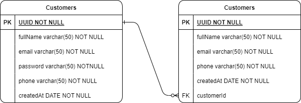

# S1-API-contactsList

### Installation and run application and tests:

### Diagram


#### Dependencies Installation with bash:
```bash
yarn install
```
### Set the enviroment variables on .env file and:

#### Run application tests with bash:
```bash
yarn test
```

#### Run application with bash:
```bash
yarn dev
```

### Imsomnia Workspace


### Imsomnia Documentation

